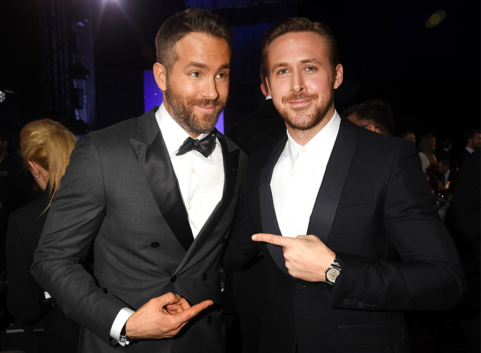

  
{{ content }}

<h2> Ryan vs Ryan: Liquid Table Demo </h2>

<table id="ryan-v-ryan">

<thead>
  <tr>
    <th>  <h3>  Ryan Reynolds  </h3>  </th>
    <th>  <h3>  Ryan Gosling  </h3>  </th>
  </tr>
</thead>

<tbody>

<tr>
  
  
  <td>
  
    
    <h4>  Strengths  </h4>
    <ul>
      
      
         <li>{{ item }}</li>
      
      
    </ul>
    
     

    <h4>  Weaknessess  </h4>
    <ul>
      
      
         <li>{{ item }}</li>
      
      
    </ul>  
    
    
  </td>
  

  <td>
  
    <h4>  Strengths  </h4>
    <ul>
      
      
        <li>{{ item }}</li>
      
      
    </ul>
    
     
    
    <h4>  Weaknessess  </h4>
    <ul>
      
      
         <li>{{ item }}</li>
      
      
    </ul>

  </td>
</tr> 

</table>

 

 

<blockquote>
<pre>
<code>

---
layout: liquid-table
title: 'amiright?'
reynolds:
  strengths:
  - good father
  - funny
  - dated alanis morissette
  weaknesses: 
  - singing
  - green lantern movie
  - tennis backhand 
gosling:
  strengths: 
  - builds houses
  - is a real boy
  - never dated alanis morissette
  weaknesses: 
  - micky mouse club
  - cries a lot
  - not ryan reynolds
---

  

### Lorem Ipsum

Lorem ipsum dolor sit amet....
